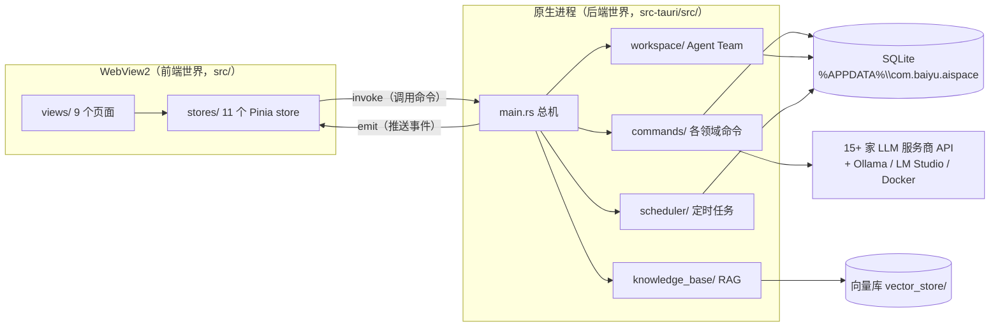

# 架构地图：东西在哪

> 这份文档回答一个问题：**"我想找 XX 功能的代码，去哪找？"**
> 读法：先记住下面三句话，再按需查表。不需要背，用几次自然就记住了。
> （文中行号和文件大小以 2026-07-17、commit `d979b4f` 为准，会随开发漂移，但结构很稳定。）

## 三句话总纲

1. **一个应用，两个世界**：界面跑在 WebView2（浏览器内核）里，是 Vue 3 + TypeScript（`src/`）；干重活的跑在原生进程里，是 Rust（`src-tauri/src/`）。两个世界唯一的桥梁是 Tauri IPC——前端 `invoke("命令名")` 调 Rust，Rust `emit("事件名")` 推前端。
2. **数据永远单向流**：Vue 视图 → Pinia store → `invoke` → Rust command → SQLite / 外部 API，结果原路返回或用事件推回。任何功能都是这条骨架的变体（细节见《02-关键数据流》）。
3. **按领域找代码**：每个功能领域在前端有一个 View + 一个 store，在后端有一个对应模块，一一对应。先想"这是哪个领域"，再看下面的速查表。

## 鸟瞰图



## 领域速查表（最常用的一张表）

| 领域 | 前端页面（src/views/） | 前端 store（src/stores/） | 后端（src-tauri/src/） |
|---|---|---|---|
| 聊天 / LLM 调用 | ChatView.vue | chat.ts（37KB）⭐ | commands/llm.rs（131KB）⭐⭐ |
| Agent Team | AgentTeamView.vue（63KB）⭐ | workspace.ts（23KB） | workspace/（commands.rs 107KB）⭐⭐ |
| RAG 知识库 | KnowledgeBaseView.vue | knowledgeBase.ts | knowledge_base/ |
| MCP 工具 | MCPView.vue | mcp.ts | commands/mcp.rs（50KB） |
| 本地部署 | LocalDeployView.vue | localModel.ts、lmStudio.ts、docker.ts | commands/local_model.rs（47KB）、lmstudio.rs、docker.rs |
| Skill | SkillsView.vue | skills.ts | commands/skills.rs |
| 定时任务 | SchedulerView.vue | scheduler.ts | scheduler/ |
| 历史记录 | HistoryView.vue | （复用 chat.ts） | db.rs |
| 设置 | SettingsView.vue（70KB）⭐ | settings.ts（23KB） | secure_storage.rs、main.rs 里的杂项命令 |

⭐ 越多 = 文件越大越重要，改动越要小心。**两个巨无霸**：`llm.rs` 是全部服务商的对接层，`workspace/commands.rs` 是 Agent 循环的心脏。

## 前端世界（src/）

```
src/
├── main.ts              入口：创建 Vue 应用，挂 Pinia（带持久化插件）和路由
├── App.vue              根组件
├── router/index.ts      9 条路由，hash 模式（桌面应用 file:// 环境的要求）
├── views/               每个页面一个文件（见上表）
├── stores/              每个领域一个 Pinia store：状态 + 调后端的方法都在这
├── components/          跨页面复用的组件，目前 3 个：
│   ├── Layout.vue         整体框架（侧边栏导航）
│   ├── ChatInput.vue      聊天输入框（33KB：文本/图片/视频/文档上传都在这）
│   └── ChatMessage.vue    单条消息渲染（26KB：Markdown/代码高亮/公式/mermaid/HTML预览）
├── styles/              全局样式；variables.scss 是设计 token 的唯一权威源
└── utils/               工具函数
```

要点：

- **View 只管展示，store 管逻辑**。想知道"点这个按钮后发生了什么"，先去 store 里找对应方法。
- 状态持久化：Pinia 的 persistedstate 插件把 settings 等 store 存进 localStorage（在 WebView2 profile 里）。
- 消息渲染链：marked（Markdown）+ highlight.js（代码）+ KaTeX（公式）+ mermaid（图表）+ DOMPurify（XSS 消毒）。
- UI 底座是 Naive UI 组件库，但视觉被自研的**黑白编辑设计系统**全面覆盖（无彩色、无圆角，详见 `design-system` skill）。

## 后端世界（src-tauri/src/）

```
src-tauri/src/
├── main.rs              总机（620 行）：注册全部 ~70 个命令；创建各领域全局状态；
│                        托盘/全局快捷键/单实例/自动更新；启动时恢复 Agent 后台循环、
│                        启动定时任务扫描循环
├── commands/
│   ├── llm.rs           ⭐⭐ 所有 LLM 服务商对接：PROVIDER_CONFIGS 服务商清单、
│   │                    请求体构造（按 provider 分支）、SSE 流式解析、工具调用循环、
│   │                    限流重试。配套手册在 docs/api-manuals/
│   ├── mcp.rs           MCP 服务器管理 + 工具调用（stdio/HTTP 两种握手）
│   ├── local_model.rs   Ollama 安装/服务/模型管理
│   ├── lmstudio.rs      LM Studio 对接
│   ├── docker.rs        Docker 容器部署
│   ├── skills.rs        Skill 存取
│   ├── app_update.rs    版本检测与 Beta 更新
│   └── constants.rs     超时常量集中地（流式禁总超时，只用读间隔超时）
├── workspace/           ⭐⭐ Agent Team：commands.rs（Agent 常驻循环+全部命令）、
│                        db.rs（6 张表）、meeting.rs（屏障式会议）、types.rs
├── knowledge_base/      RAG：commands.rs、document.rs（解析 PDF/Excel/PPT）、
│                        embedding.rs、retrieval.rs（top-k 检索）、reranker.rs、db.rs
├── scheduler/           定时任务：commands.rs（30 秒扫描循环）、db.rs、types.rs
├── db.rs                主 SQLite 层（sessions/messages/mcp_servers/skills 四张表）
├── secure_storage.rs    API 密钥进系统钥匙串（keyring 库），绝不进 SQLite
└── workspace_smoke_test.rs  唯一的自动化测试（环境变量 BAIYU_WORKSPACE_SMOKE_TEST 触发）
```

要点：

- **新增一个 Tauri command 要登记两处**：函数上加 `#[tauri::command]`，再到 `main.rs` 的 `generate_handler![]` 清单里注册。漏第二处 = 前端调用报"command not found"。
- 三个模块各有自己的 `db.rs`（主库 / knowledge_base / workspace），但都写**同一个 SQLite 文件**。
- HTTP 客户端统一用 reqwest；异步运行时是 tokio。

## 数据落在哪（磁盘上的真相）

| 数据 | 位置 | 谁在管 |
|---|---|---|
| 聊天记录、MCP 配置、Skill、Agent Team 全部状态、定时任务 | `%APPDATA%\com.baiyu.aispace\` 里的 SQLite 文件 | 各模块的 db.rs |
| SQLite 表清单 | 主库：sessions / messages / mcp_servers / skills；RAG：knowledge_bases / documents / chunks / vectors；Agent Team：workspaces / workspace_agents / workspace_messages / workspace_logs / workspace_pending_events / workspace_agent_tasks；定时：schedules | — |
| RAG 向量索引 | `%APPDATA%\com.baiyu.aispace\vector_store\` | knowledge_base/db.rs |
| API 密钥 | Windows 凭据管理器（系统钥匙串） | secure_storage.rs |
| 前端设置等 | localStorage（WebView2 profile，也在 com.baiyu.aispace 下） | Pinia persistedstate |
| 日志 | `%APPDATA%\BaiyuAISpace2\logs\app_<日期>.log`（注意：目录名和上面不同！） | main.rs 的 init_logging |

## 自检（能答上来说明地图已经装进脑子了）

1. 用户报告"设置页保存的 API Key 重启后丢了"——你会先查哪个文件？（提示：密钥不走 SQLite）
2. 想给聊天页加一个新按钮，按下后让 Rust 做点事——需要动前端哪两类文件、后端哪两处？
3. Agent Team 的对话记录和普通聊天记录，是存在同一张表里吗？
