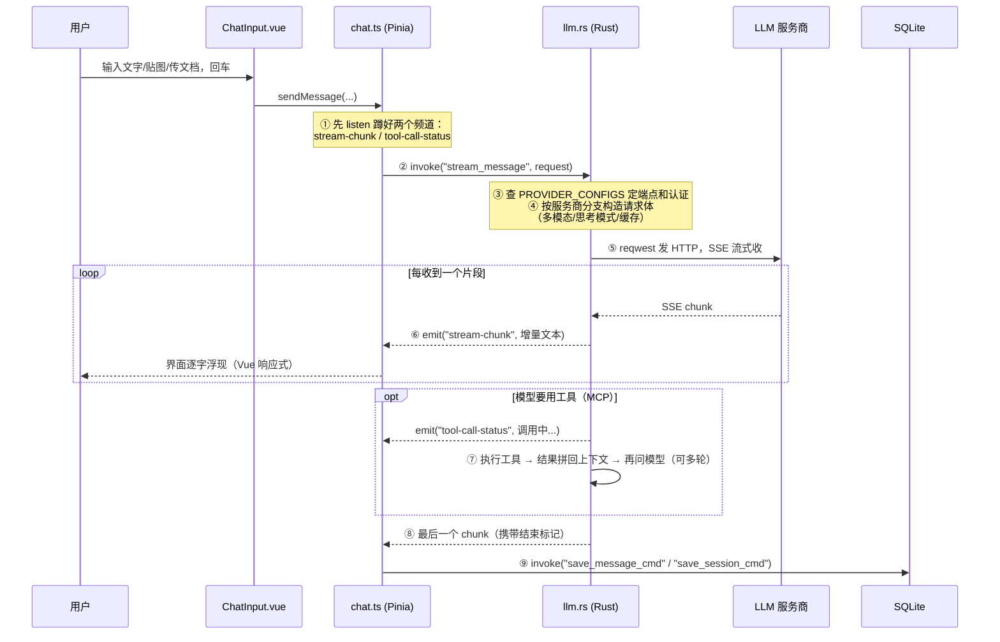

# 关键数据流：东西怎么流动

> 这份文档回答：**"一个动作发生后，数据经过了哪些站点？"**
> 掌握了数据流，出问题时你就能判断"坏在哪一层"——这比看懂每一行代码有用得多。
> 行号以 2026-07-17、commit `d979b4f` 为准，会漂移；站点顺序长期稳定。

## 先懂两个通信原语（所有流都靠它俩）

前后端隔着进程边界，只有两种说话方式：

| 原语 | 方向 | 像什么 | 用在哪 |
|---|---|---|---|
| `invoke("命令名", 参数)` | 前端 → Rust，一问一答 | 打电话 | 增删改查、发起请求 |
| `emit("事件名", 数据)` + `listen("事件名")` | Rust → 前端，单向广播 | 电台播报 | 流式输出、后台进度、Agent 动态 |

**为什么需要第二种**：`invoke` 一次只能返回一个结果，而流式回答要"一个字一个字"地送——所以模式是：前端先 `listen` 蹲好频道，再 `invoke` 发起，Rust 边收边 `emit`，结束后广播一个"完了"的标记。下面第一条流就是这个模式的完整版。

## 流 1（主线）：一条聊天消息的一生

**这是全项目最重要的一条流，所有功能都是它的亲戚。**



各站点在代码里的位置（想看源码时按这张表跳）：

| 站点 | 位置 | 干什么 |
|---|---|---|
| ① 蹲频道 | `src/stores/chat.ts:243`、`:312` | `listen("stream-chunk")`、`listen("tool-call-status")` |
| ② 发起 | `src/stores/chat.ts:801` | `invoke("stream_message", { request })` |
| ③ 服务商表 | `src-tauri/src/commands/llm.rs:209` | `PROVIDER_CONFIGS`：15+ 家的端点/认证方式 |
| ④⑤ 主流程 | `llm.rs:991 stream_message` → `:1928 run_turn` | 构造请求 + SSE 解析都在 run_turn 一带 |
| 限流重试 | `llm.rs:700 send_with_retry` | 429/过载自动重试，次数间隔可在设置页配 |
| ⑥ 播报 | `llm.rs:1158` 等多处 | `emit("stream-chunk", ...)` |
| ⑦ 工具循环 | `llm.rs:1253 execute_tool_calls` → `:1433 continue_after_tool_calls` | 调 MCP 工具、结果回填、追问模型 |
| ⑧ 收尾 | `llm.rs:1331 finalize_turn` | 发结束标记 |
| ⑨ 落库 | `chat.ts:359/:383` → `main.rs` 的 `save_*_cmd` → `db.rs` | 写 sessions / messages 表 |
| 停止按钮 | `chat.ts:1008` → `llm.rs:2209 cancel_stream` | 掐断流 |

三条汇入主流的支流：

- **知识库（RAG）**：发送前若选了知识库，`knowledgeBase.ts:340` 先 `invoke("search_knowledge_base")` 检索相关片段，拼进上下文再发。
- **文档上传**：`ChatInput.vue:249` 调 `read_document_for_context` 让 Rust 解析文件，全文注入上下文。
- **Skill**：`llm.rs:543 build_skill_context` 把启用的 Skill 拼成系统提示词的一部分。

**排障口诀**：界面完全没反应 → 查 ①②（前端到 IPC）；转圈但一个字不出 → 查 ③④⑤（请求构造/网络/服务商，看日志里的 HTTP 状态）；输出到一半断了 → 查 ⑤⑥（SSE 解析/读超时）；回答完了但历史记录丢了 → 查 ⑨（落库）。

## 流 2：Agent Team 的一次协作

和聊天的根本区别：**聊天是"你问一句我答一句"的被动模式；Agent 是常驻后台的主动循环**——每个 Agent 是 Rust 里一个永不退出的 tokio 任务，平时睡着（`await notify`），有新消息才醒来干活。

```
用户在 AgentTeamView 发消息
  → workspace.ts invoke("workspace_send_user_message")
  → Rust 写 workspace_messages 表（SQLite 就是 Agent 之间的消息总线）
  → emit("workspace://message") 让前端时间线立即刷新
  → notify_one() 摇醒目标 Agent 的后台循环
      ↓
Agent 醒来（workspace/commands.rs 的 start_agent_loop 内部）
  → 读自己的未读消息
  → 复用聊天那条流的引擎：调 llm.rs 的 run_turn（commands.rs:1085）
  → 模型的产出可能是：
      · 回复/发消息给别的 Agent → 写表 + emit + notify 对方（循环往复）
      · 调用工具 → 敏感工具先写 workspace_pending_events 等用户审批
      · 提议（如创建子 Agent）、休眠申请、向用户提问 → 同样进 pending 等裁决
      · 更新自己的任务清单/便签 → emit("workspace://tasks-updated")
      ↓
用户在前端看到动态（workspace:// 系列事件），批准/拒绝 pending 事项
  → invoke("workspace_resolve_proposal / _sleep_request / _question / _tool_approval")
  → 结果送回等在原地的 Agent 循环，继续走
```

三个值得知道的设计：

- **SQLite 当消息总线**：Agent 间通信不走内存队列而是写表，好处是全程可回放、重启不丢消息。
- **会议是屏障式协议**（`workspace/meeting.rs`）：开会时所有参会 Agent 到齐才开始、轮流发言，避免了早期版本的混乱抢话。
- **重启恢复**（`main.rs` setup 段）：应用启动时把所有存活 Agent 重新挂上后台循环；上一次运行遗留的 pending 事项因为等待通道已死，统一标过期并写日志告知用户——否则会变成"点了就报错又永远不消失的僵尸卡片"。

## 流 3：定时任务（无人值守闭环的扳机）

```
SchedulerView 创建任务 → invoke("schedule_create") → 写 schedules 表
                                    ↓
main.rs 启动时挂起的 run_scheduler_loop（scheduler/commands.rs:106）
每 30 秒扫一次表：到点的任务 → fire_schedule：
   1. 若绑定了工作组 → send_workspace_message 把预设消息注入 Agent Team
      （相当于系统替用户按了一次"发送"，之后就是流 2）
   2. emit("scheduler://triggered") 通知前端
   3. 算好下次触发时间写回表（Once 类型触发后自动禁用）
```

这就是项目定位里"定时任务 → Agent Team 干活 → 钉钉/飞书送达"闭环的第一环：送达那一步由 Agent 在流 2 里调用钉钉/飞书的 MCP 工具完成。

## 流 4：RAG 知识库（两条短流）

- **导入**：前端传文件 → `import_document` → `document.rs` 解析（PDF/Excel/PPT/文本）→ 切块（chunks 表）→ `embedding.rs` 调嵌入模型算向量 → 存 vectors 表 + vector_store。
- **检索**：拿问题算向量 → `retrieval.rs` top-k 相似度检索 → （可选）`reranker.rs` 精排 → 命中片段拼进聊天上下文（汇入流 1）。

## 自检

1. 聊天时模型回答到一半突然停住不动了——按排障口诀，你会先怀疑哪一段、去哪看证据？
2. Agent A 给 Agent B 发消息，中间经过什么介质？为什么应用重启后这条消息不会丢？
3. 定时任务到点了但 Agent 没动静——沿着流 3 数一数，有哪几个站点可能出问题？
