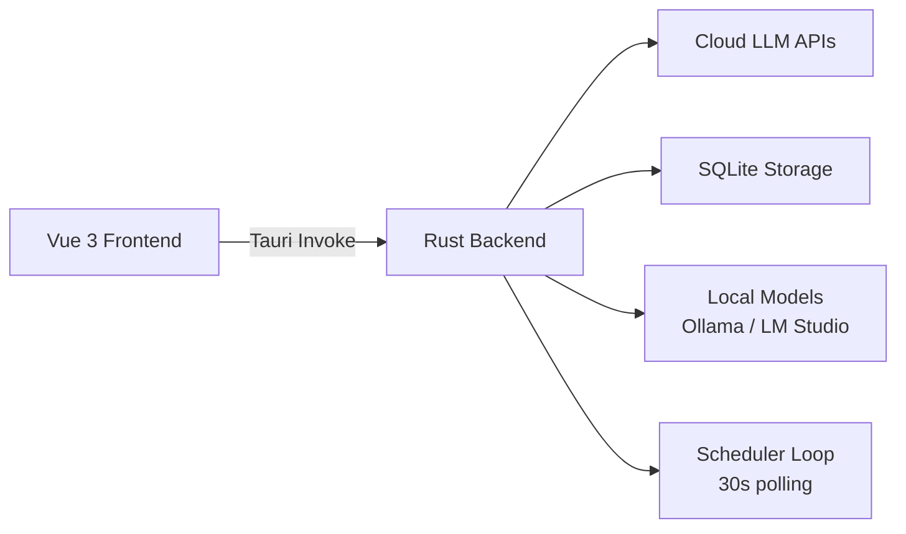

# 开发者指南

面向想从源码构建、参与贡献或做二次开发的开发者。参与贡献前请先读仓库的 [CONTRIBUTING.md](https://github.com/baiyuheniao/BaiyuAISpace2/blob/main/CONTRIBUTING.md)。

## 环境要求

| 依赖 | 版本 |
|---|---|
| Node.js | 18+ |
| pnpm | 最新版（`npm install -g pnpm`） |
| Rust | 1.75+ |
| 内存 | 8 GB RAM |
| 存储 | 2 GB 可用空间 |

## 从源码构建

```bash
git clone https://github.com/baiyuheniao/BaiyuAISpace2.git
cd BaiyuAISpace2

pnpm install         # 安装前端依赖
pnpm tauri build     # 一条命令完成前端 + 后端生产构建
# 输出：src-tauri/target/release/（NSIS 安装包在 target/release/bundle/nsis/）
```

分步构建 / 日常开发：

```bash
pnpm build           # vue-tsc 类型检查 + vite 构建前端 → dist/
cd src-tauri && cargo build   # 仅编译 Rust 后端（debug，比 tauri build 快）
pnpm tauri dev       # 开发模式：真窗口 + Vite HMR（首次约 25 秒）
pnpm lint            # eslint --fix
pnpm format          # prettier
```

> ⚠️ **构建顺序的坑**：`cargo build` 编译期会读取 `dist/` 目录（`tauri.conf.json` 的 `frontendDist`）。从未跑过 `pnpm build` 就直接 cargo，会直接 panic——先跑一次 `pnpm build`。

> 💡 Windows 首次编译较慢（Rust 链接器所致），约 3–5 分钟，属正常现象。

### 国内镜像配置（推荐）

**.npmrc**：

```
registry=https://registry.npmmirror.com
```

**src-tauri/.cargo/config.toml**：

```toml
[source.crates-io]
replace-with = 'rsproxy-sparse'
[source.rsproxy-sparse]
registry = "sparse+https://rsproxy.cn/index/"
```

## 架构总览

数据流单向：**Vue 视图 → Pinia store → `invoke` Tauri command → Rust 模块 → SQLite / 外部 API**



**技术栈**：Tauri 2 · Vue 3 + TypeScript · Naive UI（themeOverrides 收敛为黑白设计系统）· Pinia（persistedstate 持久化）· Rust + Tokio · rusqlite（WAL 模式）· marked + highlight.js + Mermaid + DOMPurify

前后端按领域一一对应，找代码先定位领域：

| 领域 | 前端 | 后端 |
|---|---|---|
| 聊天 / LLM 调用 | `views/ChatView.vue` + `stores/chat.ts` | `commands/llm.rs` |
| Agent Team | `AgentTeamView.vue` + `stores/workspace.ts` | `src-tauri/src/workspace/` |
| RAG 知识库 | `KnowledgeBaseView.vue` + `stores/knowledgeBase.ts` | `src-tauri/src/knowledge_base/` |
| MCP 工具 | `MCPView.vue` + `stores/mcp.ts` | `commands/mcp.rs` |
| 本地部署 | `LocalDeployView.vue` + 对应 stores | `commands/local_model.rs` / `lmstudio.rs` / `docker.rs` |
| Skill | `SkillsView.vue` + `stores/skills.ts` | `commands/skills.rs` |
| 定时任务 | `SchedulerView.vue` + `stores/scheduler.ts` | `src-tauri/src/scheduler/` |

**关键单点**：

- `commands/llm.rs` 是全部 15+ 家 LLM 服务商的对接层：`PROVIDER_CONFIGS` 定义服务商清单/端点/认证方式，同文件内完成请求体构造、SSE 流式解析、多轮 MCP 工具调用循环。各家 API 的核对结论沉淀在 [`docs/api-manuals/`](https://github.com/baiyuheniao/BaiyuAISpace2/tree/main/docs/api-manuals)。
- `main.rs` 注册所有 command 并 `app.manage()` 各领域 state；新增 command 记得两处都登记。
- `db.rs` 是主 SQLite 层；knowledge_base 和 workspace 各有独立的 `db.rs`。API 密钥走 `secure_storage.rs` 加密，不进普通表。
- 前端路由为 hash 模式（`createWebHashHistory`）。

## 项目约定

- **许可证头**：所有新文件须包含 MPL-2.0 头注释（格式见仓库 README「代码规范」一节）
- **UI**：严格的黑白编辑设计系统——无彩色、无圆角、Noto Serif SC 标题 + Inter 正文。token 权威源是 `src/styles/variables.scss`；提示/报错统一走左下角弹窗；表单必须写中文 placeholder
- **超时策略**：流式响应与大文件下载**禁用总超时**，只用读间隔超时（历史上因总超时误伤出过多次 bug）
- **提交信息**：`feat:` / `fix:` / `chore:` + 中文摘要
- **测试**：无常规测试套件，唯一自动化测试是 `src-tauri/src/workspace_smoke_test.rs`；正确性门禁为 `pnpm build` + `cargo build` 通过。人工测试清单见 [docs/MANUAL_TEST_CHECKLIST.md](https://github.com/baiyuheniao/BaiyuAISpace2/blob/main/docs/MANUAL_TEST_CHECKLIST.md)

## 更多文档

- 仓库文档索引：[docs/README.md](https://github.com/baiyuheniao/BaiyuAISpace2/blob/main/docs/README.md)
- Agent Team 设计文档：[docs/AgentTeamMode/](https://github.com/baiyuheniao/BaiyuAISpace2/tree/main/docs/AgentTeamMode)
- 各 LLM 服务商 API 手册：[docs/api-manuals/](https://github.com/baiyuheniao/BaiyuAISpace2/tree/main/docs/api-manuals)
