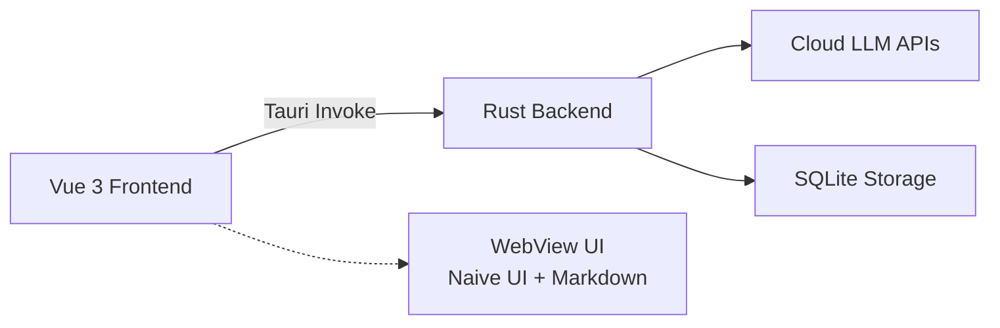

# BaiyuAISpace

<p align="center">
  
</p>

<p align="center">
  <strong>轻量级跨平台 AI Agent 开发环境</strong><br>
  <em>Lightweight Cross-Platform AI Agent Development Environment</em>
</p>

<p align="center">
  <a href="#功能特性">功能特性</a> •
  <a href="#技术架构">技术架构</a> •
  <a href="#快速开始">快速开始</a> •
  <a href="#开发指南">开发指南</a> •
  <a href="#许可证">许可证</a>
</p>

<p align="center">
  
  
  
  
</p>

---

## 🎯 项目简介

**BaiyuAISpace** 是一个专为开发者和 AI 爱好者打造的轻量级 LLM 客户端。它支持调用主流云端大模型 API，提供精美的聊天界面和流畅的交互体验。

**核心设计理念：**
- 🪶 **极轻量级**：安装包 < 20MB，内存占用 < 500MB
- 🖥️ **真跨平台**：一套代码同时支持 Windows、macOS、Linux
- 🔒 **隐私优先**：API 密钥本地加密存储，数据不出设备
- ⚡ **极速响应**：Rust 原生后端，毫秒级延迟
- 🎨 **精美界面**：现代化 UI 设计，支持深色模式

---

## ✨ 功能特性

### 已支持 (v0.1.0)
- [x] **多源 LLM 接入**：OpenAI、Claude、Kimi 统一接口
- [x] **精美聊天界面**：Markdown 渲染、代码高亮、深色模式
- [x] **会话管理**：新建对话、历史记录浏览
- [x] **API 配置**：多提供商切换、模型选择
- [x] **本地存储**：设置持久化、会话本地保存

### 开发中
- [ ] **流式输出**：实时打字机效果
- [ ] **本地模型**：Llama.cpp 集成
- [ ] **SQLite 持久化**：完整会话历史存储
- [ ] **RAG 知识库**：文档向量化检索
- [ ] **插件系统**：第三方工具集成
- [ ] **移动端**：Android 适配

---

## 🏗️ 技术架构



**技术栈：**
- **Tauri 2.0**：替代 Electron，安装包减少 80%
- **Vue 3 + TypeScript**：响应式开发，类型安全
- **Naive UI**：精美组件库，暗色主题
- **Rust**：零成本抽象，内存安全
- **Pinia**：状态管理，持久化存储

---

## 💻 系统要求

| 配置 | 要求 |
|------|------|
| **OS** | Windows 10+ / macOS 10.15+ / Ubuntu 20.04+ |
| **Node.js** | 18+ |
| **Rust** | 1.75+ |
| **内存** | 8 GB RAM |
| **存储** | 2 GB 可用空间 |

---

## 🚀 快速开始

### 1. 环境准备

```bash
# 安装 Node.js 18+ 和 pnpm
npm install -g pnpm

# 安装 Rust
curl --proto '=https' --tlsv1.2 -sSf https://sh.rustup.rs | sh
```

### 2. 克隆仓库

```bash
git clone https://github.com/baiyuheniao/BaiyuAISpace.git
cd BaiyuAISpace
```

### 3. 安装依赖

```bash
# 前端依赖（使用国内镜像）
pnpm install

# Rust 依赖
cd src-tauri
cargo build
cd ..
```

### 4. 启动开发服务器

```bash
# 同时启动 Vue 开发服务器和 Tauri 桌面窗口
pnpm tauri dev
```

首次编译 Rust 需要 3-5 分钟，请耐心等待。

---

## 🛠️ 开发指南

### 国内镜像配置（推荐）

**.npmrc**（前端依赖）：
```
registry=https://registry.npmmirror.com
```

**src-tauri/.cargo/config.toml**（Rust 依赖）：
```toml
[source.crates-io]
replace-with = 'rsproxy-sparse'
[source.rsproxy-sparse]
registry = "sparse+https://rsproxy.cn/index/"
```

### 项目结构

```
BaiyuAISpace/
├── src/                      # Vue 3 前端
│   ├── components/           # 组件
│   │   ├── Layout.vue        # 布局组件
│   │   ├── ChatMessage.vue   # 消息组件
│   │   └── ChatInput.vue     # 输入组件
│   ├── views/                # 页面
│   │   ├── ChatView.vue      # 对话页
│   │   ├── SettingsView.vue  # 设置页
│   │   └── HistoryView.vue   # 历史页
│   ├── stores/               # Pinia 状态管理
│   │   ├── settings.ts       # 设置状态
│   │   └── chat.ts           # 对话状态
│   ├── router/               # 路由配置
│   └── styles/               # 样式文件
├── src-tauri/                # Rust 后端
│   ├── src/
│   │   ├── main.rs           # 应用入口
│   │   └── commands/
│   │       └── llm.rs        # LLM API 接口
│   ├── Cargo.toml
│   └── tauri.conf.json
├── package.json
└── vite.config.ts
```

### 构建发布

```bash
# 构建生产版本
pnpm tauri build

# 输出目录
src-tauri/target/release/bundle/
```

---

## 🔌 支持的 LLM 提供商

| 提供商 | 国家/地区 | 代表模型 | 特点 |
|--------|----------|---------|------|
| **OpenAI** | 🇺🇸 美国 | **gpt-5**, **gpt-4.1**, gpt-4o, o3, o4-mini | 行业标杆，功能全面 |
| **Anthropic** | 🇺🇸 美国 | claude-3-5-sonnet, claude-3-opus | 长文本、代码能力强 |
| **Google** | 🇺🇸 美国 | gemini-2.0-pro, gemini-1.5-pro | 多模态、上下文长 |
| **Azure OpenAI** | 🇺🇸 美国 | gpt-4o, gpt-4 | 企业级、合规性好 |
| **Mistral AI** | 🇫🇷 法国 | mistral-large, codestral | 欧洲开源先锋 |
| **Moonshot (Kimi)** | 🇨🇳 中国 | **kimi-k2.5** (K2.5), **kimi-k2-thinking**, moonshot-v1 | 长文本（256K） |
| **智谱 AI (GLM)** | 🇨🇳 中国 | glm-4-plus, **glm-4-air-250414**, glm-4-flash | 中文理解强 |
| **阿里 (通义)** | 🇨🇳 中国 | qwen-max, **qwen-plus-latest**, qwen-coder-plus | 开源模型优秀 |
| **百度 (文心)** | 🇨🇳 中国 | ernie-4.0, ernie-4.0-turbo | 中文生态完善 |
| **字节 (豆包)** | 🇨🇳 中国 | doubao-pro-256k, doubao-pro-32k | 性价比高 |
| **DeepSeek** | 🇨🇳 中国 | deepseek-chat, **deepseek-reasoner (R1)** | 推理能力强，价格低 |
| **硅基流动 (SiliconFlow)** | 🇨🇳 中国 | Qwen2.5, Llama-3.1, **DeepSeek-V3/R1** | 多模型聚合，价格优惠 |
| **MiniMax** | 🇨🇳 中国 | abab6.5s, abab6.5 | 多模态、语音合成 |
| **零一万物 (Yi)** | 🇨🇳 中国 | yi-large, yi-medium | 开源+商用 |
| **自定义** | 🌐 全球 | 任意 OpenAI 兼容接口 | 灵活配置 Base URL |

> 💡 **提示**：模型更新频繁，各服务商的完整模型列表请查看官方文档。如需添加新模型，可在设置中直接输入模型名称。

---

## 🐛 已知问题

1. **Windows 首次编译慢**：Rust 链接器在 Windows 上较慢，首次编译需 3-5 分钟
2. **图标缺失**：需要添加应用图标到 `src-tauri/icons/`

---

## 📝 代码规范

**文件头许可证声明（必须）：**

Vue/TypeScript：
```javascript
/* This Source Code Form is subject to the terms of the Mozilla Public
 * License, v. 2.0. If a copy of the MPL was not distributed with this
 * file, You can obtain one at https://mozilla.org/MPL/2.0/. */
```

Rust：
```rust
// This Source Code Form is subject to the terms of the Mozilla Public
// License, v. 2.0. If a copy of the MPL was not distributed with this
// file, You can obtain one at https://mozilla.org/MPL/2.0/.
```

---

## 📜 许可证

本软件采用 **[Mozilla Public License 2.0](https://www.mozilla.org/en-US/MPL/2.0/)** (MPL-2.0) 开源。

### 简单人话版
- ✅ **你可以**：自由使用、修改、商用，甚至嵌入到闭源软件中
- ✅ **你必须**：如果你修改了本项目的**现有文件**，请公开你的修改
- ✅ **你可以**：添加新文件并选择**任意许可证**（包括闭源商业许可）
- ❌ **你不能**：删除许可证声明或假装这是你原创的软件

---

## 🤝 贡献指南

欢迎 Issue 和 PR！请确保：
1. 代码通过 `cargo clippy` 和 `pnpm lint` 检查
2. 所有新文件包含 MPL-2.0 头注释
3. 提交信息遵循 [Conventional Commits](https://www.conventionalcommits.org/)

---

<p align="center">
  <sub>Built with ❤️ by Baiyu using Vue 3 + Tauri + Rust</sub><br>
  <sub>Licensed under MPL-2.0 · 核心开源 · 生态开放</sub>
</p>
