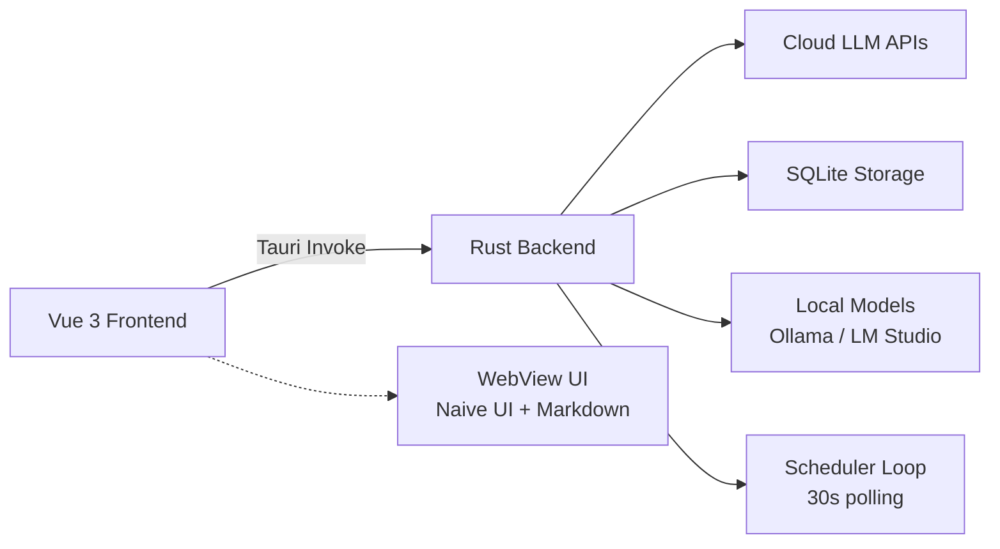

# BaiyuAISpace

<p align="center">
  
</p>

<p align="center">
  <strong>轻量级跨平台 AI Agent 开发环境</strong><br>
  <em>Lightweight Cross-Platform AI Agent Development Environment</em>
</p>

<p align="center">
  <a href="#功能特性">功能特性</a> •
  <a href="#技术架构">技术架构</a> •
  <a href="#快速开始">快速开始</a> •
  <a href="#开发指南">开发指南</a> •
  <a href="#许可证">许可证</a>
</p>

<p align="center">
  
  
  
  
</p>

***

## 🎯 项目简介

**BaiyuAISpace** 是一个专为开发者和 AI 爱好者打造的 LLM 客户端与 Agent 开发环境。支持调用主流云端大模型 API，以及通过 Ollama / LM Studio 运行本地模型，提供比大多数同类工具更低的上手门槛、更高的自由度和更低廉的成本。

（别问1去哪里了，1废了 :( ）

**核心设计理念：**

- 🪶 **极轻量级**：低资源平台也能有不错的性能表现，启动超快
- 🖥️ **真跨平台**：一套代码同时支持 Windows、macOS、Linux
- 🔒 **隐私优先**：API 密钥本地加密存储，数据不出设备
- ⚡ **极速响应**：Rust 原生后端，毫秒级延迟
- 🤖 **Agent 原生**：内置多 Agent 协作工作组、MCP 工具调用、RAG 知识库、定时任务

***

## ✨ 功能特性

### 对话 & 模型接入

- [x] **多源 LLM 接入**：OpenAI、Claude、Kimi 等 15+ 提供商统一接口
- [x] **本地模型**：支持 Ollama 和 LM Studio（OpenAI 兼容接口），无需云端
- [x] **流式输出**：实时打字机效果、支持中断
- [x] **精美聊天界面**：Markdown 渲染、代码高亮、深色模式
- [x] **会话管理**：历史记录浏览、会话永久保存

### RAG / 知识库

- [x] **文档导入**：TXT / PDF / Markdown 等格式
- [x] **向量化检索**：本地 Embedding，混合检索（向量 + 关键词）
- [x] **知识库挂接**：可在对话中或 Agent 中动态引用

### MCP 工具

- [x] **多服务器管理**：Stdio / HTTP 两种协议
- [x] **工具自动发现**：启动时枚举，LLM 函数调用透明代理
- [x] **预设一键安装**：内置浏览器自动化、文件系统等常用预设

### Skill

- [x] **自定义 Skill**：名称 + 描述 + 指令三段式定义，绑定 MCP 服务器和知识库
- [x] **预设库**：内置 23 条开发者 / 商务 / 通用场景预设，一键导入

### Agent Team（多 Agent 协作）

- [x] **工作组管理**：新建 / 删除工作组，配置最大 Agent 数量上限
- [x] **Agent 生命周期**：手动添加 / 删除；主 Agent 可提议创建子 Agent（需用户审批）
- [x] **四种状态**：Idle / Running / Meeting / Sleeping
- [x] **消息路由**：点对点或广播，用户可直接与任意 Agent 对话
- [x] **圆桌会议**：任意 Agent 可发起 `workspace_meeting`，其余成员轮流就议题发言，超时自动跳过
- [x] **活动时间线**：消息 + 日志合并展示，`scheduled_trigger` 定时触发有专属条目
- [x] **工具集**：`workspace_agent_list` / `workspace_message` / `workspace_meeting` / `workspace_create_agent` / `workspace_sleep` / `workspace_ask_user` / `workspace_agent_note`

### 定时任务（Scheduler）

- [x] **独立侧边栏模块**：与 RAG / MCP 并列，全局管理所有定时任务
- [x] **四种调度类型**：单次（once）/ 间隔（interval）/ 每天（daily）/ 每周（weekly）
- [x] **Agent Team 集成**：可绑定工作组 + 目标 Agent，触发时自动发消息唤醒 Agent
- [x] **广播支持**：`target_agent_id = null` 时广播给工作组全部 Agent
- [x] **后台轮询**：Rust 端每 30 秒检查一次到期任务，App 运行期间全自动触发
- [x] **快速入口**：Agent Team 页的时钟图标直接跳转到定时任务页并预填当前工作组筛选

### 开发中 / 规划中

- [ ] **会议异常恢复**：App 重启后清理残留 `meeting` 状态；LLM 报错时立即发信号而非等满超时
- [ ] **插件系统**：第三方工具扩展
- [ ] **Web UI**：浏览器端访问
- [ ] **移动端**：Android/iOS 适配（计划新建独立子项目，主项目不优先实现本地推理等重型功能）

***

## 🏗️ 技术架构


```mermaid
graph LR
    A[Vue 3 Frontend] -->|Tauri Invoke| B[Rust Backend]
    B --> C[Cloud LLM APIs]
    B --> D[SQLite Storage]
    B --> E[Local Models<br/>Ollama / LM Studio]
    B --> F[Scheduler Loop<br/>30s polling]
    A -.-> G[WebView UI<br/>Naive UI + Markdown]
```

**技术栈：**

- **Tauri 2.0**：替代 Electron，安装包减少 80%
- **Vue 3 + TypeScript**：响应式开发，类型安全
- **Naive UI**：精美组件库，暗色主题
- **Rust + Tokio**：异步后端，`CancellationToken` 管理 Agent 生命周期
- **Pinia**：状态管理，持久化存储
- **SQLite（rusqlite）**：本地持久化，WAL 模式

***

## 💻 系统要求

| 配置          | 要求                                         |
| ----------- | ------------------------------------------ |
| **OS**      | Windows 10+ / macOS 10.15+ / Ubuntu 20.04+ |
| **Node.js** | 18+                                        |
| **Rust**    | 1.75+                                      |
| **内存**      | 8 GB RAM                                   |
| **存储**      | 2 GB 可用空间                                  |

***

## 🚀 快速开始

### 1. 环境准备

```bash
# 安装 Node.js 18+ 和 pnpm
npm install -g pnpm

# 安装 Rust
curl --proto '=https' --tlsv1.2 -sSf https://sh.rustup.rs | sh
```

### 2. 克隆仓库

```bash
git clone https://github.com/baiyuheniao/BaiyuAISpace.git
cd BaiyuAISpace2
```

### 3. 安装依赖 & 构建（.exe之类的包）

```bash
pnpm install
pnpm build           # 构建前端 → dist/
cd src-tauri
cargo build          # 构建 Rust 后端（首次约 3-5 分钟）
// 感觉四条命令麻烦的 pnpm install 之后 pnpm tauri build就行
```

> **注意**：必须先 `pnpm build` 再 `cargo build`，Rust 编译时会读取 `dist/` 目录。

### 4. 启动开发服务器（这个命令后端不能热更新？）

```bash
pnpm tauri dev
```

***

## 🛠️ 开发指南

### 国内镜像配置（推荐）

**.npmrc**：

```
registry=https://registry.npmmirror.com
```

**src-tauri/.cargo/config.toml**：

```toml
[source.crates-io]
replace-with = 'rsproxy-sparse'
[source.rsproxy-sparse]
registry = "sparse+https://rsproxy.cn/index/"
```

### 项目结构

```
BaiyuAISpace2/
├── src/                        # Vue 3 前端
│   ├── components/
│   │   ├── Layout.vue          # 侧边栏 + 主布局
│   │   └── ChatMessage.vue     # 消息渲染
│   ├── views/
│   │   ├── ChatView.vue        # 对话页
│   │   ├── AgentTeamView.vue   # Agent 工作组
│   │   ├── SchedulerView.vue   # 定时任务（独立页）
│   │   ├── SkillsView.vue      # Skill 管理 + 预设库
│   │   ├── KnowledgeBaseView.vue # 知识库管理
│   │   ├── MCPView.vue         # MCP 管理
│   │   ├── LocalDeployView.vue # 本地部署管理
│   │   ├── HistoryView.vue     # 历史记录
│   │   └── SettingsView.vue    # 设置
│   ├── stores/
│   │   ├── chat.ts
│   │   ├── workspace.ts        # Agent Team 状态
│   │   ├── scheduler.ts        # 定时任务状态
│   │   ├── skills.ts           # Skill 状态
│   │   ├── knowledgeBase.ts    # 知识库状态
│   │   ├── mcp.ts              # MCP 状态
│   │   └── settings.ts         # 设置状态
│   └── router/index.ts
├── src-tauri/src/
│   ├── main.rs
│   ├── commands/
│   │   └── llm.rs              # LLM 流式调用
│   ├── workspace/              # Agent Team 后端
│   │   ├── commands.rs         # Tauri 命令 + Agent 循环 + 会议逻辑
│   │   ├── db.rs
│   │   └── types.rs
│   ├── scheduler/              # 定时任务后端
│   │   ├── commands.rs         # Tauri 命令 + 后台轮询循环
│   │   ├── db.rs               # 数据库操作
│   │   └── types.rs            # 数据库类型定义
│   ├── knowledge_base/
│   └── secure_storage.rs      # 安全存储
└── package.json
```

### 构建发布

```bash
pnpm tauri build
# 输出：src-tauri/target/release/ .exe就在这里 NSIS安装包在target/release/bundle/nsis/
```

***

## 🔌 支持的 LLM 提供商

| 提供商                    | 国家/地区   | 代表模型                                                            | 特点                   |
| ---------------------- | ------- | --------------------------------------------------------------- | -------------------- |
| **OpenAI**             | 🇺🇸 美国 | gpt-4o, gpt-5                                             | 有条件而且不知道用啥就这个            |
| **Anthropic**          | 🇺🇸 美国 | claude-sonnet-4-6, claude-opus-4.8                        | 长文本、代码能力强                   |
| **Google**             | 🇺🇸 美国 | gemini-3.1-pro                                            | 多模态、上下文长                    |
| **Azure OpenAI**       | 🇺🇸 美国 | gpt-4o, gpt-4                                             | 企业级、合规性好（OpenAI服务还是要翻） |
| **Mistral AI**         | 🇫🇷 法国 | mistral-medium-3.5                                        | 欧洲开源先锋               |
| **Moonshot (Kimi)**    | 🇨🇳 中国 | kimi-k2.6                                                | 长文本，强中文场景，Agent 能力强        |
| **智谱 AI (GLM)**        | 🇨🇳 中国 | glm-5.1                                                 | 中文通用能力强 尤其代码               |
| **阿里 (通义)**            | 🇨🇳 中国 | qwen3.6 max，qwen                                      | 同参数性能更好，低成本，多模态不错     |
| **百度 (文心)**            | 🇨🇳 中国 | ernie-4.0, ernie-4.0-turbo                            | 中文生态完善（似乎出场率不高？）        |
| **字节 (豆包)**            | 🇨🇳 中国 | doubao-pro-256k, doubao-pro-32k                        | 性价比高，上手简单                  |
| **DeepSeek**           | 🇨🇳 中国 | deepseek-V4, deepseek-r1                                | 价格便宜，编程和推理能力很强           |
| **硅基流动 (SiliconFlow)** | 🇨🇳 中国 | Qwen2.5, DeepSeek-V3/R1                               | 多模型聚合，价格优惠                 |
| **MiniMax**            | 🇨🇳 中国 | abab6.5s                                                  | 多模态、语音合成、Agent能力不错      |
| **零一万物 (Yi)**          | 🇨🇳 中国 | yi-large, yi-medium                                    | 开源+商用 我没怎么见         |
| **本地（Ollama）**         | 🌐 本地   | Llama 3、Qwen3、Gemma 等                             | 完全离线，数据不出设备          |
| **本地（LM Studio）**      | 🌐 本地   | 任意 GGUF 模型                                        | GUI 友好，OpenAI 兼容接口   |
| **自定义**                | 🌐 全球   | 任意 OpenAI 兼容接口                                   | 灵活配置 Base URL        |

> 💡 各服务商模型更新频繁，完整列表请查看官方文档。设置中可直接输入模型名称添加新模型。

***

## 🐛 已知问题

1. **Windows 首次编译慢**：Rust 链接器在 Windows 上较慢，首次编译需 3-5 分钟
2. **会议中途 App 重启**：重启后 Agent 的 `meeting` 状态不会自动清理，需手动操作

***

## 📝 代码规范

所有新文件须包含 MPL-2.0 头注释：

**Vue / TypeScript：**

```javascript
/* This Source Code Form is subject to the terms of the Mozilla Public
 * License, v. 2.0. If a copy of the MPL was not distributed with this
 * file, You can obtain one at https://mozilla.org/MPL/2.0/. */
```

**Rust：**

```rust
// This Source Code Form is subject to the terms of the Mozilla Public
// License, v. 2.0. If a copy of the MPL was not distributed with this
// file, You can obtain one at https://mozilla.org/MPL/2.0/.
```

***

## 📜 许可证

本软件采用 **[Mozilla Public License 2.0](https://www.mozilla.org/en-US/MPL/2.0/)** (MPL-2.0) 开源。
**注意·本项目还有 BaiyuAISpace 许可证补充条款**

***

## 🤝 贡献指南

欢迎 Issue 和 PR！请确保：

1. 代码通过 `cargo clippy` 和 `pnpm build`（含 `vue-tsc --noEmit`）检查
2. 所有新文件包含 MPL-2.0 头注释
3. 提交信息遵循 [Conventional Commits](https://www.conventionalcommits.org/)

***

<p align="center">
  <sub>Built with ❤️ by Baiyu using Vue 3 + Tauri + Rust</sub><br>
  <sub>Licensed under MPL-2.0 · 核心开源 · 生态开放</sub>
</p>
